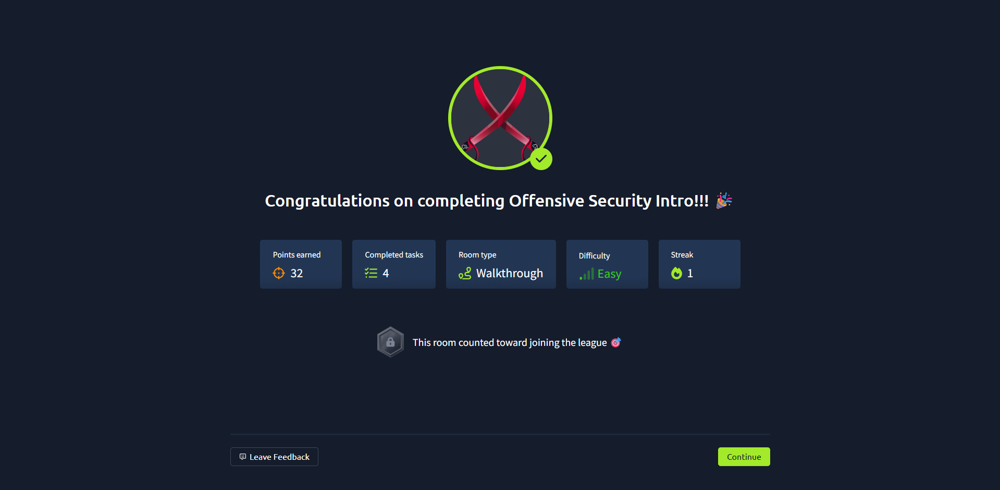
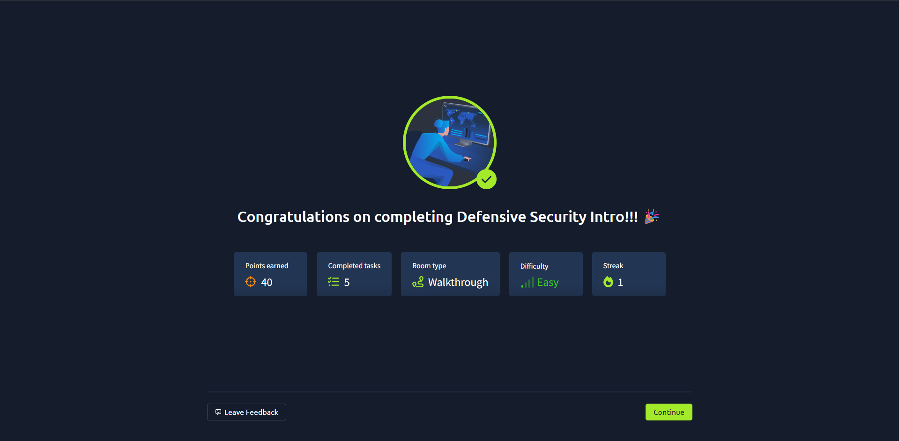
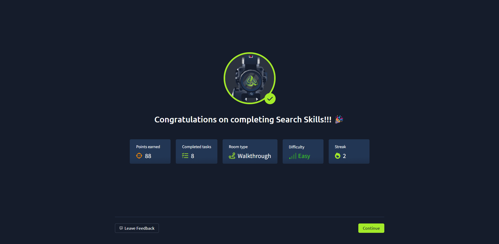

# TryHackMe Labs – Martin Eftoski

This repository contains my personal notes, reflections, and command references while completing labs on TryHackMe as part of my cybersecurity learning journey.

---

## Labs Completed

### 🛡️ Offensive Security Intro
- ✅ Completed on: Aug 6, 2025  
- 🔗 [TryHackMe Room](https://tryhackme.com/room/offensivesecurityintro)

#### 🧠 Key Learnings:
- Network enumeration with Nmap  
- Basic web vulnerability discovery  
- Hands-on exploitation techniques

#### 📝 Summary:
This room introduced the core principles of offensive cybersecurity, focusing on how attackers think and operate.
I learned how to identify vulnerable services, perform basic enumeration using Nmap, and simulate simple exploitation scenarios.
The lab gave me a solid foundation for more advanced penetration testing concepts.

#### 📸 Screenshot:

---

### 🛡️ Defensive Security Intro
- ✅ Completed on: Aug 7, 2025  
- 🔗 [TryHackMe Room](https://tryhackme.com/room/defensivesecurityintro)

#### 🧠 Key Learnings:
- Understanding the role of defensive cybersecurity  
- Basics of threat detection and prevention  
- Introduction to firewall rules and network monitoring  
- Familiarization with SIEM tools (like Splunk)

#### 🔧 Tools / Techniques Used:
- IPTables basics  
- Log analysis  
- Network monitoring concepts  
- Linux command-line utilities

#### 📝 Summary:
This room introduced core concepts of defensive security, focusing on how to protect systems from common threats.
I learned how defenders think, what tools they use, and how logs and traffic monitoring are used in real-world scenarios.

#### 📸 Screenshot:

## 🔍 Search Skills

📅 Completed: August 7, 2025  
🧠 Focus: OSINT (Open Source Intelligence), Reconnaissance  
🔗 [TryHackMe Room](https://tryhackme.com/room/searchskills)  

### What I learned:
- How to use Google Dorking to uncover information online
- Username and email address investigation techniques
- Metadata extraction from images and documents
- Basic use of OSINT tools and methodology

📌 This room strengthened my recon skills and gave me insight into real-world information gathering techniques.
A solid foundation for any aspiring cybersecurity professional.

#### 📸 Screenshot:

